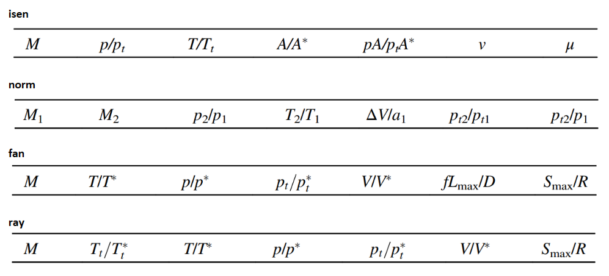

# Functions for Fluid Dynaimcs Classes

This guide provides details on how to use various MATLAB functions replacing the parameter tables from the textbook: **Fundamentals of Gas Dynamics Third Edition** By Robert D. Zucker and Oscar Biblarz. Interpolation is done automatically and answers are achieved as if you were using the tables and doing linear interpolation manually.

&nbsp;
___
&nbsp;

## **Flow Tables**

The function `tables()` is used to replace the following tables:

- Isentropic Flow
- Normal Shock
- Fanno Flow
- Rayleigh Flow

### **Usage:**

```matlab
tables(table, variable_known, variable_value, variable_wanted)
```

### **Arguments:**
- `table`: Table name as a string and abreviated (isen, norm, fan, ray).
- `variable_known`: The name of the variable you have, as a string.
- `variable_value`: The value of the known variable.
- `variable_wanted`: The name of the variable you want, as a string.

### **Example:**

```matlab
T1_Tt1 = tables('isen', 'M', M1, 'T_Tt')
```

### **Note:**
- The function will output 2 values in a 1x2 matrix if there are two possible answers (weak and strong shock).  
- Gamma is assumed to be 1.4

### **Table Headers for reference:**  


&nbsp;
___
&nbsp;

## **Properties of Gasses EE and SI**

Functions `gasEE()` and `gasSI()` are used to replace the properties of gasses tables.

### **Usage:**

```matlab
gasEE(gas, property)
gasSI(gas, property)
```

### **Arguments:**
- `gas`: The name of the gas as a string.
- `property`: The property of the gas as a string.

### **Example:**

```matlab
cp = gasSI('air', 'cp')
% or
[cp, units] = gasSI('air', 'cp')
```

### **Table Headers for reference:**


### **Available Gasses:**
- air
- ammonia
- argon
- carbon dioxide
- carbon monoxide
- helium
- hydrogen
- methane
- nitrogen
- oxygen
- water vapor

&nbsp;
___
&nbsp;

## **Figure AD1**

Functions `gettheta()`, `getdelta()`, and `getM1()` replace Figure AD1.

### **Usage:**

```matlab
gettheta(delta, M1) % returns theta
getdelta(theta, M1) % returns delta
getM1(theta, delta) % returns M1
```

### **Figure AD1:**

